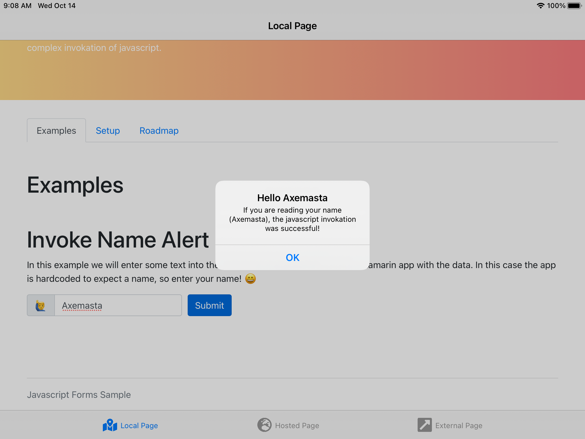

# Javascript Forms
Documentation site dedicated to invoking javascript events in Xamarin Forms.

I'm currently investigating how I can hook into javascript events in a Xamarin Forms Web View, I'm documenting my reserach and progress in this repository. You can view the documentation site on [GitHub Pages](https://axemasta.github.io/JavascriptForms/index.html). You can also pull the repository and run the sample app to see what I've managed to get working!

I'm not sure what the limits are yet but I would like to:

- Invoke C# Actions From Javascript
- Inject Custom Javascript At RunTime
- Make The Invokation Payload Generic (or as hands off as possible)
- Be fancy and use Typescript

### Screenshots

Since I've not documented much yet, here are some screenshots :)

| Invoke Locally  |  |
| --------------- | ------------------------------------------------------------ |
| Invoke Hosted   |  |
| Invoke External |  |